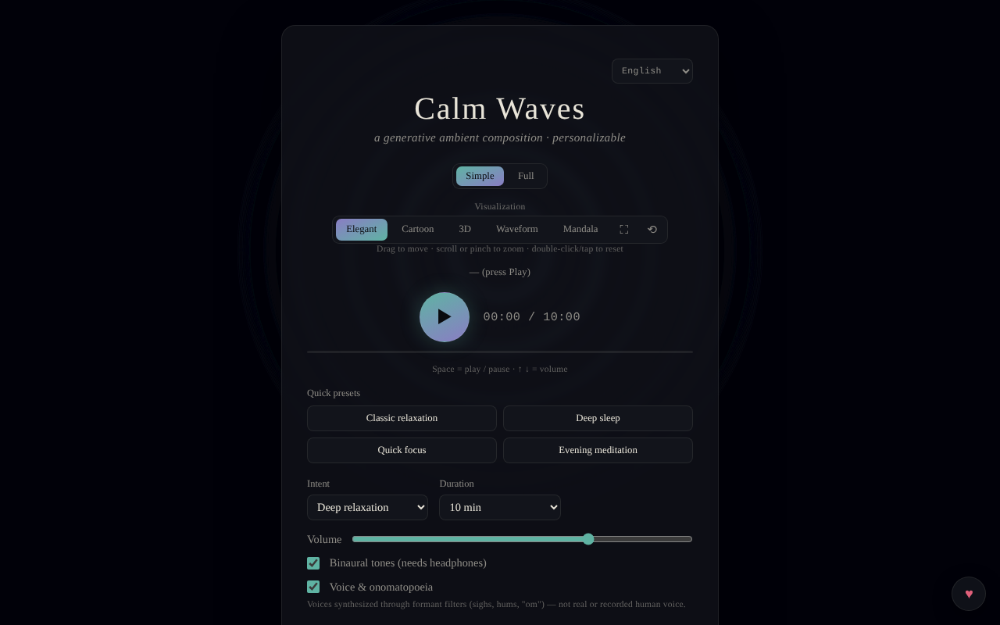

# Calm Waves

Compoziție ambientală generativă, personalizabilă, pentru relaxare, somn, concentrare și meditație.

**Live:** https://chiuta.github.io/CalmWaves/

## Ce este

Calm Waves este o aplicație single-file (`index.html`) care generează algoritmic, în browser, piese ambientale calme (Web Audio API). Alegi intenția, paleta tonală, densitatea, durata, textura de fundal și ritmul, iar aplicația generează o „variantă” identificabilă printr-un cod pe care îl poți copia și reîncărca. Include vizualizări animate și export audio.

## Funcții

- Două moduri: **Simplu** și **Complet** (acesta din urmă afișează controalele avansate).
- Presetări rapide (Relaxare clasică, Somn adânc, Focus rapid, Meditație serală) și preseturi personalizate (maximum 12, salvate local).
- Parametri: intenție (Relaxare profundă, Somn, Concentrare calmă, Meditație), paletă tonală (Caldă, Nocturnă, Eterică, Adâncă), densitate (Minimală, Echilibrată, Bogată), durată (5–60 min), textură de fond (Neutră, Ploaie, Ocean, Vânt), ritm (Lent, Natural, Activ).
- Unde binaurale (necesită căști), voce sintetizată prin filtre formant (nu voce umană înregistrată) cu profiluri de voce, gong la început și scoică la final (și butoane manuale 🔔 / 🐚).
- Redare continuă (variante noi la nesfârșit) și oprire automată (15–90 min).
- Egalizator (grav/mediu/înalt) și lățime stereo; volum.
- Cod de variantă: copiere (📋), variantă nouă (🔀), „Încarcă” pentru a reda un cod; istoric al variantelor recente.
- Vizualizări: Elegantă, Cartoon, 3D, Undă, Mandala; ecran complet, resetare vizualizare, deplasare/zoom cu mouse sau atingere.
- Export: WAV, AIFF și „Exportă comprimat” (WebM/Ogg/M4A, în funcție de ce suportă browserul, prin MediaRecorder).
- Menține ecranul activ în timpul redării, dacă browserul suportă Wake Lock.
- Interfață în 7 limbi: English, Română, Français, Italiano, Español, Português, Deutsch.
- Secțiuni explicative: „Cum funcționează, tehnic” și „Ce spune cercetarea, de fapt”.

## Manual de utilizare

1. Alege limba din selectorul de limbă din antet.
2. Alege modul **Simplu** sau **Complet**.
3. Alege un preset rapid sau setează manual intenția, paleta, densitatea, durata, textura și ritmul.
4. Apasă ▶ (Ascultă) pentru a porni. Taste: **Spațiu** = redare/pauză, **↑ / ↓** = volum (±5). Tastele nu acționează când focusul e pe un câmp, buton sau listă.
5. Schimbă vizualizarea (Elegantă / Cartoon / 3D / Undă / Mandala); trage pentru a muta, scroll sau pensare pentru zoom, dublu-clic pentru resetare.
6. Pentru a reface o piesă: copiază „Cod variantă” (📋), iar mai târziu lipește-l și apasă „Încarcă”. 🔀 generează o variantă nouă.
7. Pentru preset propriu (mod Complet): scrie un nume în „Nume preset nou” și apasă „+ Adaugă preset curent” (sau Enter).
8. Setează „Oprire automată” dacă asculți la culcare.
9. Export: „Exportă ca WAV”, „AIFF” sau „Exportă comprimat” (cu „Anulează” pentru oprire).

## Confidențialitate și rețea

- **Stocare locală:** doar presetările personalizate, în `localStorage` (cheia `calmWavesCustomPresets`). Nu am găsit în cod alte chei persistente.
- **Rețea:** codul nu face apeluri `fetch`/XHR și nu încarcă scripturi, fonturi sau resurse externe; audio și grafica sunt generate local. Singurele adrese externe sunt linkuri de navigare deschise la click: trade-free.org, Patreon și Buy Me a Coffee (butonul ♥).
- Subsolul aplicației declară: CC0, trade-free, 100% offline, fără telemetrie.

## Limitări și disclaimer

Conținut informativ și de relaxare; nu este dispozitiv medical și nu înlocuiește sfatul medical sau tratamentul. Secțiunea „Ce spune cercetarea, de fapt” rezumă afirmații despre studii (ex. unde binaurale și anxietate) care nu au fost verificate independent în acest audit și nu trebuie luate ca promisiune terapeutică. Cine are epilepsie sau afecțiuni neurologice ar trebui să ceară sfatul unui medic înainte de a folosi unde binaurale. Pagina nu are Content-Security-Policy.

O notă scurtă (RO/EN) este afișată sub subsolul aplicației.

## Rulare locală / offline

Descarcă `index.html` și deschide-l în browser; nu necesită internet. Unele funcții depind de browser (Wake Lock, MediaRecorder pentru exportul comprimat).

## Licență

CC0 1.0 Universal (domeniu public) — vezi fișierul LICENSE

## Audit

Audit: 2026-10-10 — afirmațiile „fără rețea / fără telemetrie” corespund codului (fără `fetch`/XHR/CDN).

## Autor

Alexio — Alexandru-Ionuț Chiuță, contact: alexio@trom.tf.

## English summary

Calm Waves is a single-file generative ambient music app (Web Audio API) with intent, palette, density, duration, texture and pace controls, binaural tones, synthesized formant voices, shareable variant codes, five visualizations and WAV/AIFF/compressed export. 7 UI languages. Only custom presets are stored in localStorage; no network requests apart from optional outbound links. CC0.
